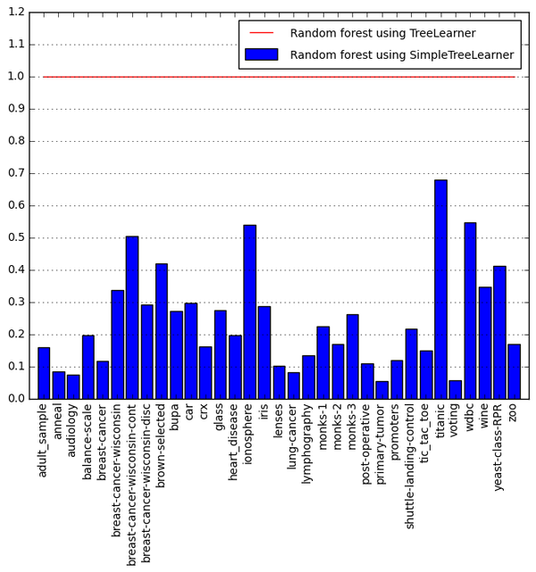

Random forest classifiers now use **Orange.classification.tree.SimpleTreeLearner**by default, which considerably shortens their construction times.

Using a random forest classifier is easy.

	import Orange

	iris = Orange.data.Table('iris')
	forest = Orange.ensemble.forest.RandomForestLearner(iris, trees=200)
	for instance in iris:
	    print forest(instance), instance.get_class()

The example above loads the iris dataset and trains a random forest classifier with 200 trees. The classifier is then used to label all training examples, printing its prediction alongside the actual class value.

Using **SimpleTreeLearner** insted of **TreeLearner** substantially reduces the training time. The image below compares construction times of Random Forest classifiers using a SimpleTreeLearner or a TreeLearner as the base learner.

By setting the base_learner parameter to **TreeLearer** it is possible to revert to the original behaviour:

    
	tree_learner = Orange.classification.tree.TreeLearner()
	forest_orig = Orange.ensemble.forest.RandomForestLearner(base_learner=tree_learner)

