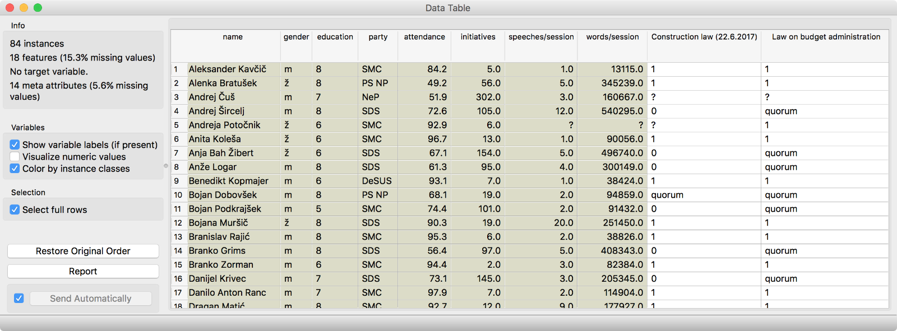
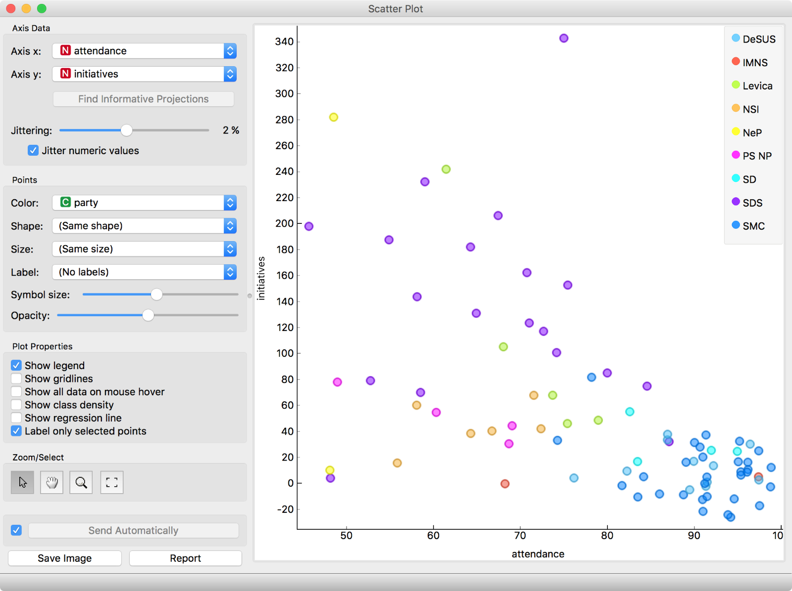
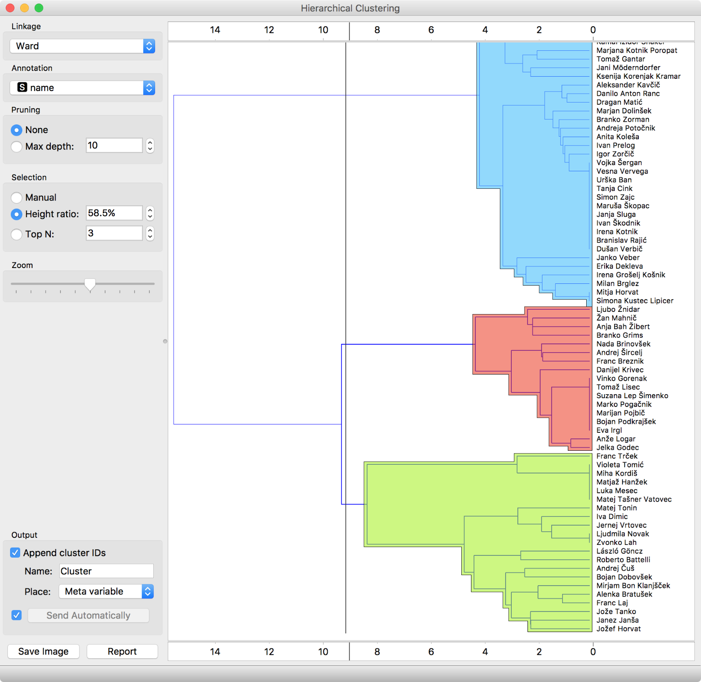
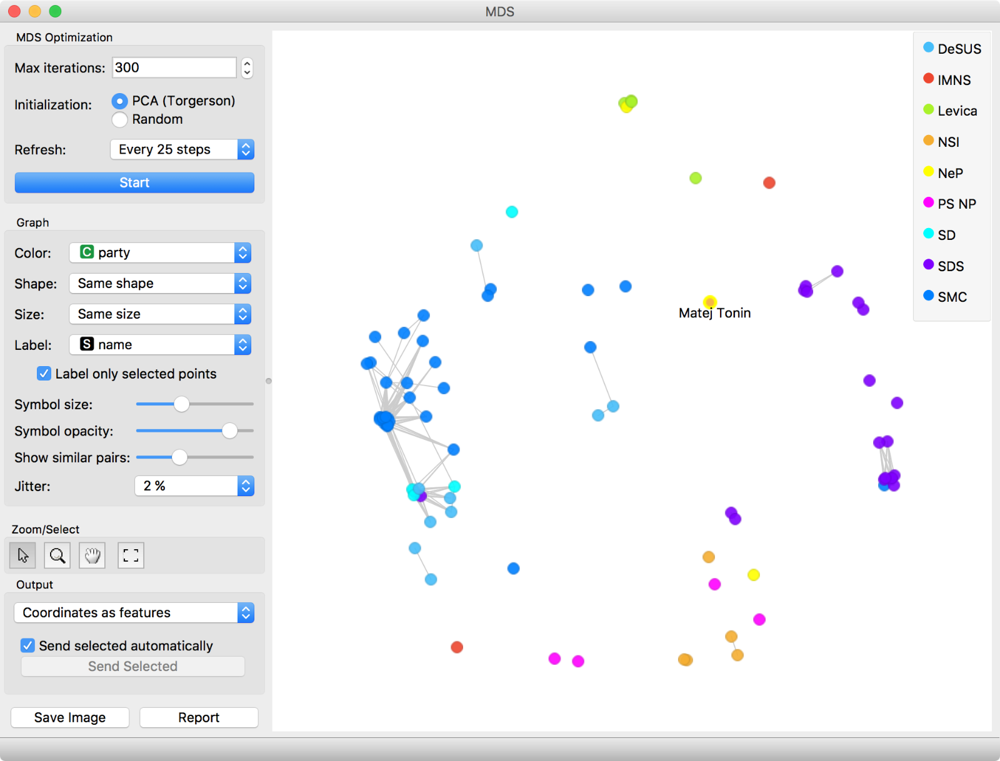
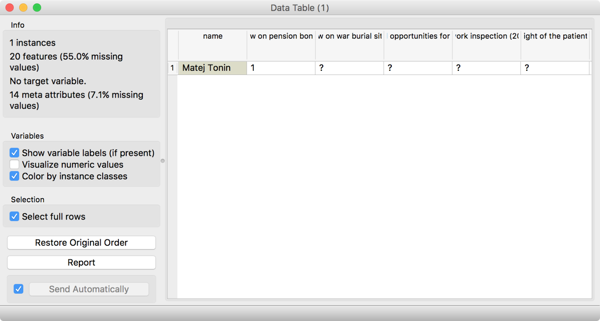
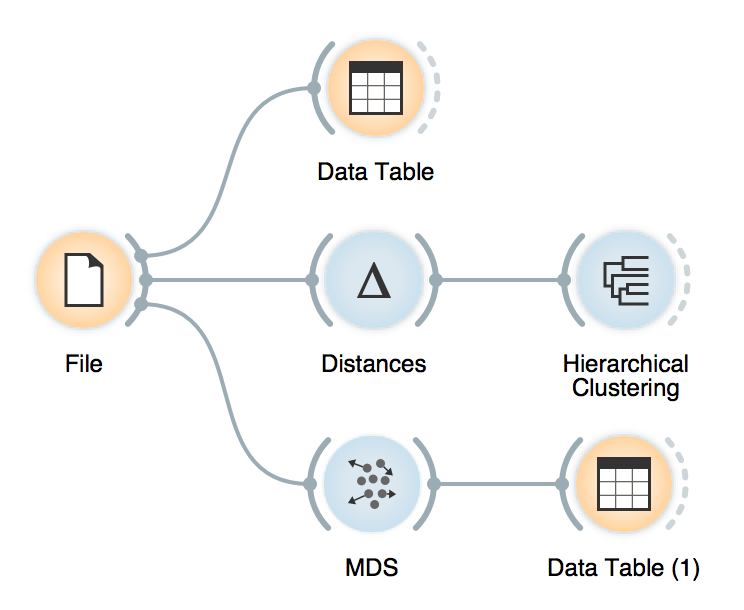

Two days ago we held another Introduction to Data Mining workshop at our faculty. This time the target audience was a group of public sector professionals and our challenge was finding the right data set to explain key data mining concepts. Iris is fun, but not everyone is a biologist, right? Fortunately, we found this really nice data set with ballot counts from the Slovenian National Assembly (thanks to [Parlameter](https://parlameter.si/)).

**Related:** [Intro to Data Mining for Life Scientists](/blog/2016/10/02/intro-to-data-mining-for-life-scientists/)

Workshop for the Agency for Communication Networks and Services (AKOS).

The data contains ballot counts, statistics, and description for 84 members of the parliament (MPs). First, we inspected the data in a Data Table. Each MP is described with 14 meta features and has 18 ballot counts recorded.

Out data has 84 instances, 18 features (ballot counts) and 14 meta features (MP description).

We have some numerical features, which means we can also inspect the data in Scatter Plot. We will plot MPs' attendance vs. the number of their initiatives. Quite interesting! There is a big group of MPs who regularly attend the sessions, but rarely propose changes. Could this be the coalition?

Scatter plot of MPs' session attendance (in percentage) and the number of initiatives. Already an interesting pattern emerges.

The next question that springs to our mind is - can we discover interesting voting patterns from our data? Let us see. We first explored the data in Hierarchical Clustering. Looks like there are some nice clusters in our data! The blue cluster is the coalition, red the SDS party and green the rest (both from the opposition).

**Related:** [Hierarchical Clustering: A Simple Explanation](/blog/2015-12-02-hierarchical-clustering-a-simple-explanation/)

Hierarchical Clustering visualizes a hierarchy of clusters. But it is hard to observe similarity of pairs of data instances. How similar are Luka Mesec and Branko Grims? It is hard to tell...

But it is hard to inspect so many data instances in a dendrogram. For example, we have no idea how similar are the voting records of Eva Irgl and Alenka Bratušek. Surely, there must be a better way to explore similarities and perhaps verify that voting patterns exist at even a party-level... Let us try MDS. MDS transforms multidimensional data into a 2D projection so that similar data instances lie close to each other.

MDS can plot a multidimensional data in 2D so that similar data points lie close to each other. But sometimes this optimization is hard. This is why we have grey lines connecting the dots - the dots connected are similar at the selected cut-off level (Show similar pairs slider).

Ah, this is nice! We even colored data points by the party. MDS beautifully shows the coalition (blue dots) and the opposition (all other colors). Even parties are clustered together. But there are some outliers. Let us inspect Matej Tonin, who is quite far away from his orange group. Seems like he was missing at the last two sessions and did not vote. Hence his voting is treated differently.

Data Table is a handy tool for instant data inspection. It is always great to check, what is on the output of each widget.

It is always great to inspect discovered groups and outliers. This way an expert can interpret the clusters and also explain, what outliers mean. Sometimes it is simply a matter of data (missing values), but sometimes we could find shifting alliances. Perhaps an outlier could be an MP about to switch to another party.

The final workflow.

You can have fun with [these data](https://raw.githubusercontent.com/ajdapretnar/datasets/master/data/slovenian-national-assembly-eng.tab), too. Let us know if you discover something interesting!

